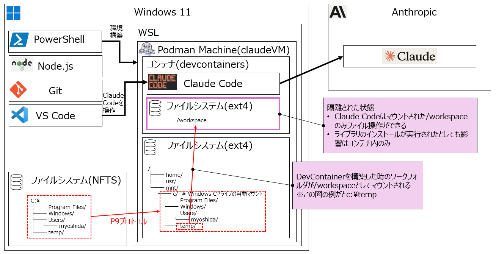

# Similar Image Search

## 内容

ローカルで実行する類似画像検索ツール

## 開発環境の構築

こちらを参考にさせていただきました。感謝。

[devcontainerでClaude Codeを動かす(Windows)](https://zenn.dev/acntechjp/articles/fc111da7542e00)


### インストール

- 上の記事

### Claude Code の起動

- プロジェクトのルートで以下を実行します。

``` powershell
.\Script\Claude-Code.ps1
```

## 参考

- [devcontainerでClaude Codeを動かす(Windows)](https://zenn.dev/acntechjp/articles/fc111da7542e00)
- https://knaka20blue.hatenablog.com/entry/2025/01/23/125300